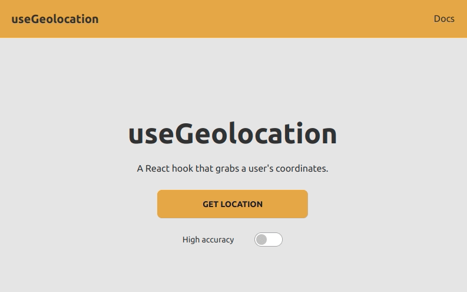

# [useGeolocation](https://devmegan.github.io/geolocation/)

A react app using the [useGeolocation](https://github.com/streamich/react-use/blob/master/docs/useGeolocation.md) hook from [react-use](https://github.com/streamich/react-use). Try it [here](https://devmegan.github.io/geolocation/).

Has some basic error handling: 

Styled with [daisyUI](https://daisyui.com/) and [tailwindCSS](https://tailwindcss.com/).

Tested using [React Testing Library](https://testing-library.com/docs/react-testing-library/intro/). 

---

Clone me and then run me using `npm start`
Test me using `npm test` / `npm test --coverage`
Build me using `npm build`